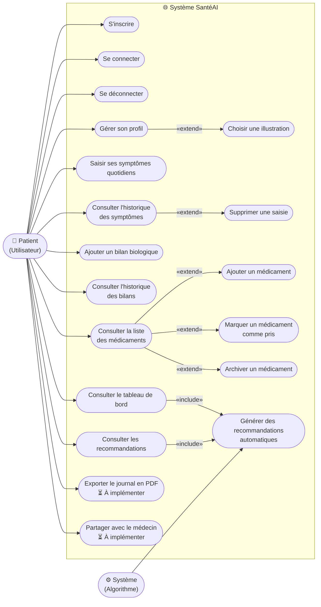

# Diagramme des Cas d'Utilisation (DCU)
**SantéAI — Dashboard web de suivi patient**
**BTS SIO SLAM — Épreuve E6 — 2026**

---

## Rendu visuel (Mermaid — preview dans VS Code ou sur mermaid.live)

> **Pour visualiser** : copiez le bloc ci-dessous sur **https://mermaid.live** ou installez l'extension **Markdown Preview Mermaid Support** dans VS Code.

---

## Description textuelle des cas d'utilisation

### Acteurs

| Acteur | Rôle |
|---|---|
| **Patient** | Utilisateur principal de la plateforme. Il saisit ses données cliniques et consulte son suivi de santé. |
| **Système (Algorithme)** | Acteur secondaire. Il analyse automatiquement les données saisies et génère des recommandations. |

---

### Cas d'utilisation détaillés

#### 🔐 Authentification

| CU | Précondition | Scénario principal | Post-condition |
|---|---|---|---|
| **S'inscrire** | Aucun compte existant avec cet email | Saisie nom, prénom, email, mot de passe → validation → création du compte | Compte créé, redirection vers connexion |
| **Se connecter** | Compte existant | Saisie email + mot de passe → vérification → session ouverte | Session PHP active, accès au dashboard |
| **Se déconnecter** | Session active | Clic sur "Déconnexion" → session détruite | Session supprimée, retour à la page de connexion |

#### 👤 Profil

| CU | Précondition | Scénario principal | Post-condition |
|---|---|---|---|
| **Gérer son profil** | Connecté | Modification nom, prénom, médecin → enregistrement | Profil mis à jour, session rafraîchie |
| **Choisir une illustration** | Dans la page profil | Sélection d'un avatar parmi 5 options | Avatar sauvegardé, affiché dans la navbar |

#### 📋 Symptômes

| CU | Précondition | Scénario principal | Post-condition |
|---|---|---|---|
| **Saisir les symptômes** | Connecté | Réglage des curseurs (fatigue, humeur), coches des symptômes, saisie des mesures → enregistrement | Saisie créée ou mise à jour (1 par jour), trigger SQL possible |
| **Consulter l'historique** | Au moins une saisie | Affichage du tableau des 60 dernières saisies | — |
| **Supprimer une saisie** | Saisie existante | Clic "Supprimer" + confirmation JavaScript | Saisie supprimée |

#### 🩺 Bilans biologiques

| CU | Précondition | Scénario principal | Post-condition |
|---|---|---|---|
| **Ajouter un bilan** | Connecté | Saisie des valeurs (TSH, T3, T4, etc.) + date → enregistrement | Bilan créé, trigger SQL analyse la TSH |
| **Consulter l'historique** | Au moins un bilan | Tableau avec coloration selon les normes médicales | — |

#### 💊 Médicaments

| CU | Précondition | Scénario principal | Post-condition |
|---|---|---|---|
| **Ajouter un médicament** | Connecté | Saisie nom, dosage, moment de prise | Médicament ajouté à la liste |
| **Marquer comme pris** | Médicament actif | Clic "Marquer pris" | Prise enregistrée pour la journée |
| **Archiver un médicament** | Médicament actif | Clic "Archiver" + confirmation | Médicament inactif (historique conservé) |

#### 📊 Dashboard & Recommandations

| CU | Précondition | Scénario principal | Post-condition |
|---|---|---|---|
| **Consulter le tableau de bord** | Connecté | Affichage des stats, graphiques Chart.js, médicaments du jour | Algorithme de recommandations exécuté |
| **Recevoir des recommandations** | Données saisies | L'algorithme analyse les données récentes → génère des conseils | Conseils affichés, marqués comme lus |

#### ⏳ Fonctionnalités futures

| CU | Description |
|---|---|
| **Exporter en PDF** | Génération d'un journal de bord PDF (FPDF/TCPDF) téléchargeable |
| **Partager avec le médecin** | Envoi automatique d'un rapport mensuel par email (PHPMailer) |

---

## Règles de gestion principales

- **RG01** : Un patient ne peut saisir qu'**un seul enregistrement de symptômes par jour** (contrainte UNIQUE KEY en BDD).
- **RG02** : Le mot de passe est stocké **uniquement sous forme de hash bcrypt** (password_hash PHP), jamais en clair.
- **RG03** : Toute page (hors authentification) est **inaccessible sans session active**.
- **RG04** : Archiver un médicament **conserve l'historique de prises** (soft delete).
- **RG05** : Les recommandations en doublon dans la journée **ne sont pas ré-insérées** (vérification avant INSERT).
- **RG06** : Les valeurs TSH, T3, T4 sont analysées automatiquement par **trigger SQL** à chaque insertion de bilan.
